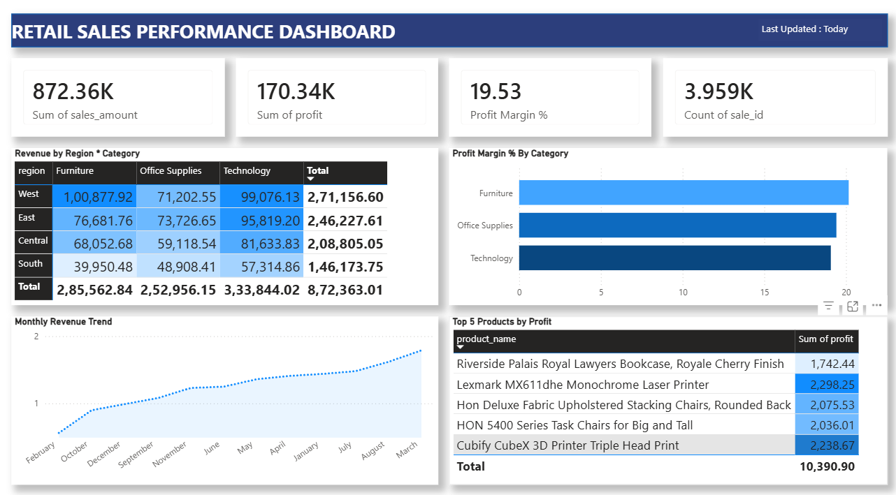

# Retail Sales Intelligence Dashboard

An end-to-end data analytics project combining data warehouse design, an automated ETL pipeline, and AI-generated business insights using a large language model.

## What This Project Does

1. Designs a proper data warehouse using a star schema (fact + dimension tables)
2. Builds an ETL pipeline that extracts, cleans, and loads sales data into PostgreSQL
3. Uses a Groq-hosted LLM to automatically generate written executive insight summaries from the data
4. 

## Tech Stack

- **Data Warehouse:** PostgreSQL (Neon)
- **ETL:** Python (Pandas, SQLAlchemy)
- **AI Insights:** Groq LLM (Llama 3.1)

## Data Warehouse Schema (Star Schema)

- **fact_sales**: quantity, sales_amount, profit, linked to all dimensions
- **dim_date**: full_date, day, month, quarter, year
- **dim_product**: product_name, category, sub_category
- **dim_customer**: customer_name, segment
- **dim_region**: region, state, city

## Files

- `db.py` — database connection
- `extract.py` — reads raw CSV data
- `transform.py` — cleans data and builds star schema tables
- `load.py` — loads data into PostgreSQL
- `ai_insights.py` — queries the warehouse and generates AI-written business insight summaries
- `sql/create_schema.sql` — warehouse table definitions
- `sql/queries.sql` — analytical SQL queries

## Key Skills Demonstrated

- Data warehouse design (star schema)
- ETL pipeline development
- SQL for analytical reporting
- Applied Generative AI — using an LLM to automate business insight generation from structured data

## Dashboard Features

- KPI summary cards (Revenue, Profit, Margin %, Orders)
- Revenue by Region × Category (interactive heatmap)
- Profit Margin % by Category
- Monthly Revenue Trend
- Top 5 Products by Profit

## How to Run This

1. Set up a PostgreSQL database (e.g., Neon)
2. Run `sql/create_schema.sql` to create the warehouse tables
3. Set `DATABASE_URL` and `GROQ_API_KEY` environment variables
4. Run `python extract.py`, then `transform.py`, then `load.py`
5. Run `python ai_insights.py` to generate an AI insight summary

## Sample AI-Generated Insight

> "Our latest sales data analysis reveals a significant revenue growth trend, with total revenue increasing by 8.5% year-over-year. The West region has emerged as a top performer..."
